## Управление складом товаров.
### Программа должна предоставлять REST API для:
> * Работа с приложением возможна только после авторизации пользователей посредством логина и пароля.
> > Система должна поддерживать две роли пользователей – администратор и пользователь.
> > Администратору склада доступны все операции по просмотру и модификации данных, пользователь может только просматривать информацию.
> > Информация о ролях  и пользователях хранится в базе данных. При запуске приложения должна создаваться таблица со списком ролей и пользователей. При повторном запуске приложения эта информация не должна быть изменена или удалена.


***В качестве запросов к серверу использовал консольную утилиту*** [Curl](https://curl.haxx.se/download.html)
#
> > #### - Видео инструкция по запуску и выполнению запросов к серверу.
> > [](https://youtu.be/94vm2lKswKo)
> > 
#
> > #### - Видео демонстрации тестирования приложения.
> > [](https://youtu.be/D6EWK6dAcCU)

#
**1. Создание нового пользователя** 
```
curl -H Content-Type:application/json -X POST -d "{\"id\":\"0\",\"name\":\"Maxim\",\"list\":"[""]"}" http://localhost:8080/users
```
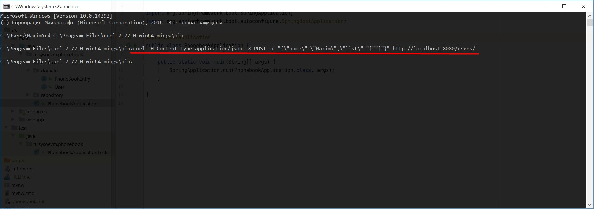
#

**2. Получение пользователя по id** 
```
curl -i http://localhost:8080/users/0
```
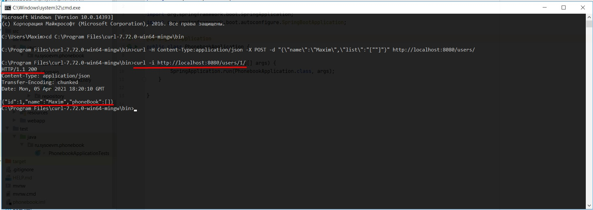
#

**3. Обновление пользователя с id=0** 
```
curl -i -H Content-Type:application/json -X PUT -d "{\"id\":\"0\",\"name\":\"Update User\"}" http://localhost:8080/users
```
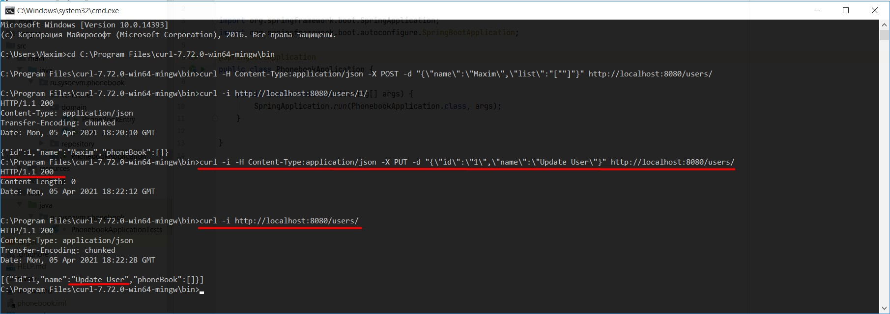
#

**4. Удаление пользователя с id=0** 
```
curl -i -X DELETE http://localhost:8080/users/0
```
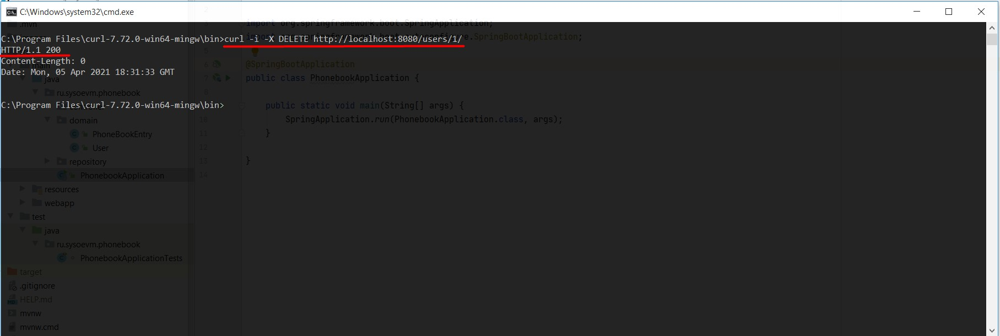
#

**5. Получение всех пользователей**
```
curl -i http://localhost:8080/users
```
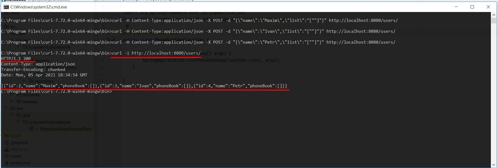
#

**6. Создание нескольких записей в телефонных книгах пользователей. Пользователи должны быть уже созданы!**
```
curl -H Content-Type:application/json -X POST -d "{\"id\":\"1\",\"name\":\"Contact 1\",\"phone\":\"1234567\"}" http://localhost:8080/users/1/phonebook/
curl -H Content-Type:application/json -X POST -d "{\"id\":\"2\",\"name\":\"Contact 2\",\"phone\":\"2222222\"}" http://localhost:8080/users/1/phonebook/
curl -H Content-Type:application/json -X POST -d "{\"id\":\"3\",\"name\":\"Contact 3\",\"phone\":\"3333333\"}" http://localhost:8080/users/1/phonebook/
curl -H Content-Type:application/json -X POST -d "{\"id\":\"1\",\"name\":\"Contact 1\",\"phone\":\"1111111\"}" http://localhost:8080/users/2/phonebook/
curl -H Content-Type:application/json -X POST -d "{\"id\":\"2\",\"name\":\"Contact 2\",\"phone\":\"2222222\"}" http://localhost:8080/users/2/phonebook/
curl -H Content-Type:application/json -X POST -d "{\"id\":\"1\",\"name\":\"User 1\",\"phone\":\"1231231\"}" http://localhost:8080/users/3/phonebook/
curl -H Content-Type:application/json -X POST -d "{\"id\":\"2\",\"name\":\"User 2\",\"phone\":\"3213213\"}" http://localhost:8080/users/3/phonebook/
```
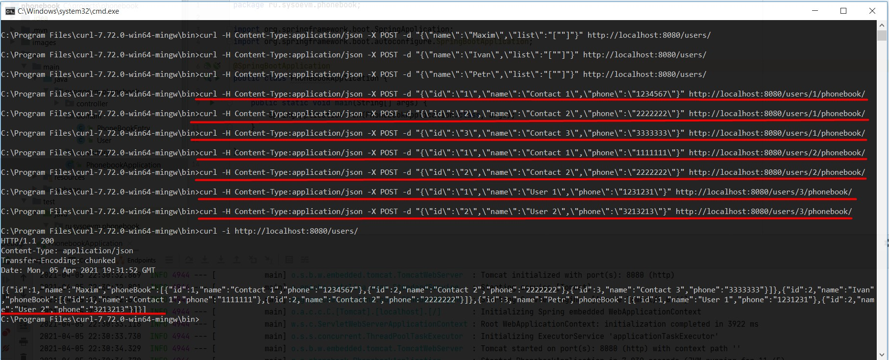
#

**7. Обновление записи в телефонной книге пользователя**
```
curl -i -H Content-Type:application/json -X PUT -d "{\"id\":\"1\",\"name\":\"Update User\",\"phone\":\"7654321\"}" http://localhost:8080/users/0/phonebook/
```
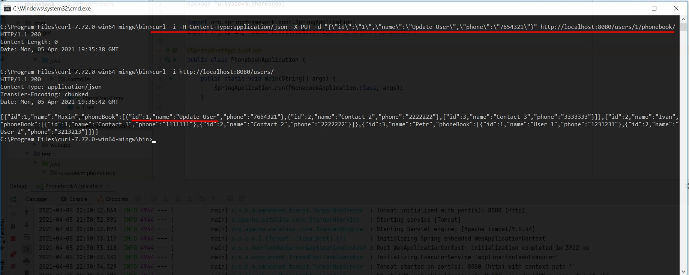
#


**8. Получение телефонной записи по её id**
```
curl -i http://localhost:8080/users/0/phonebook/1/
```
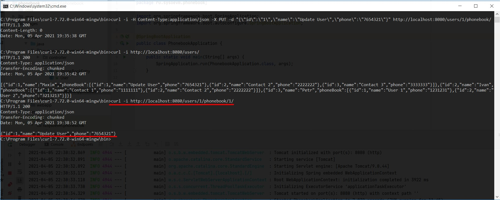
#

**9. Удаление записи у пользователя**
```
curl -i -X DELETE http://localhost:8080/users/0/phonebook/1/
```
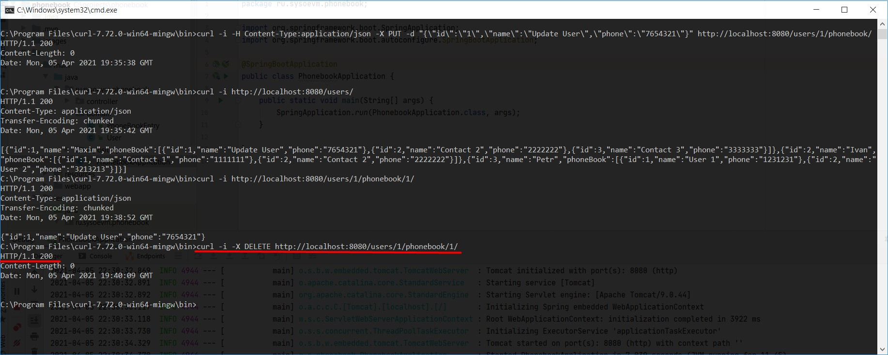
#


**10. Получение всех записей в телефонной книге пользователя**
```
curl -i http://localhost:8080/users/0/phonebook/
```
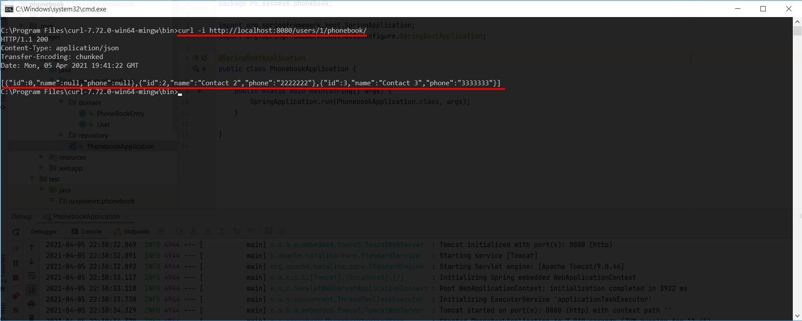
#

**11. Поиск пользователей по имени (или его части)**
```
curl -i http://localhost:8080/users/search/name?name=Max
```
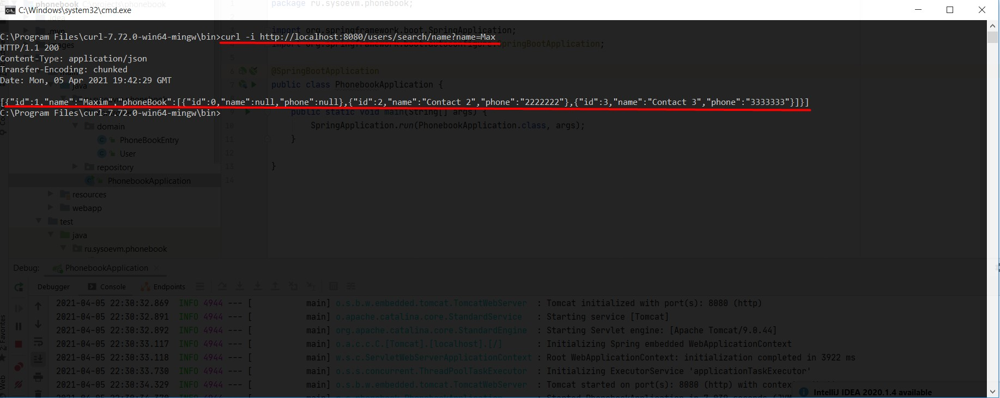
#

**12. Поиск телефонной записи по номеру телефона**
```
curl -i http://localhost:8080/users/search/phone?phone=1111111
```
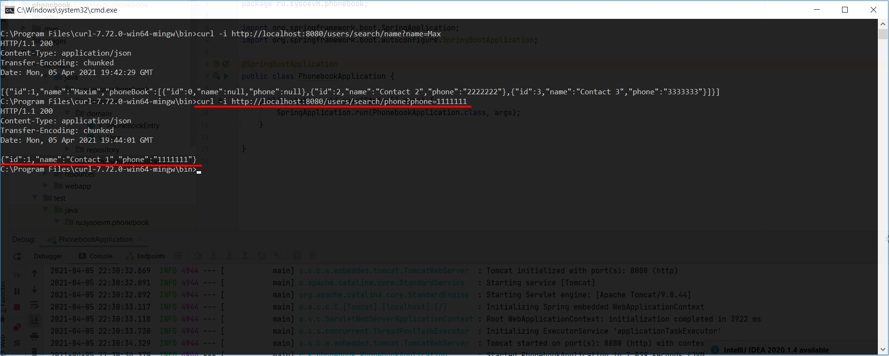
#
